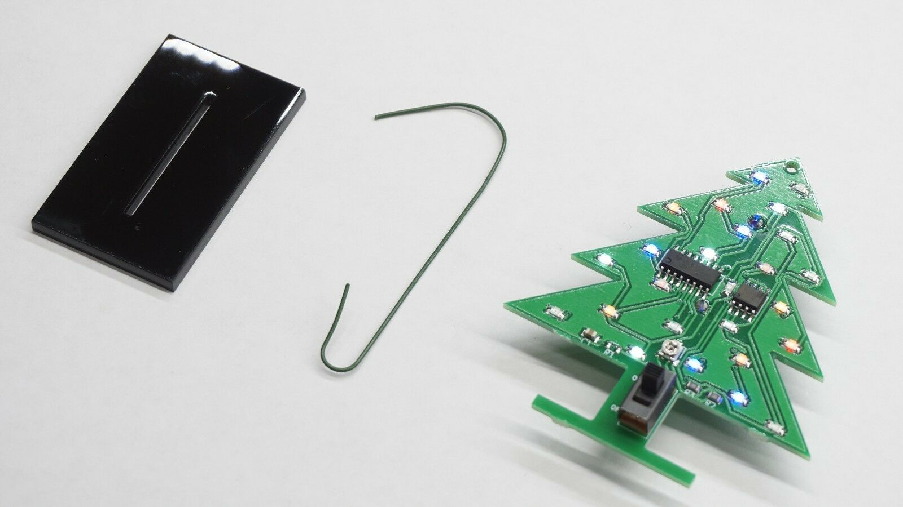
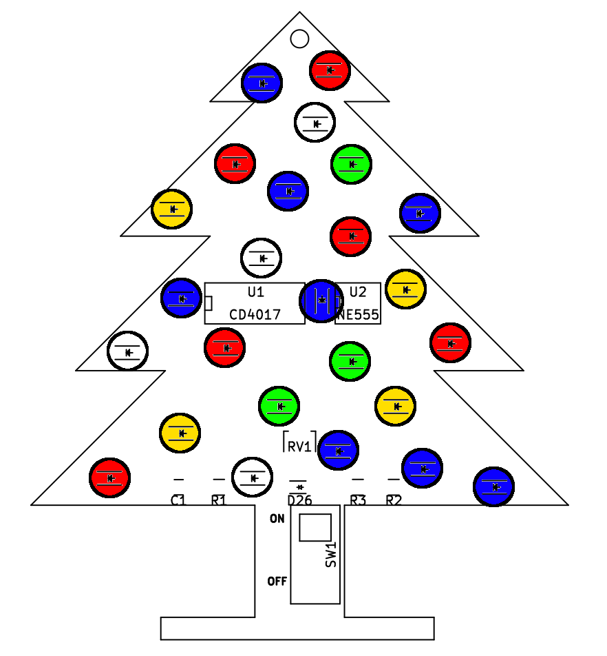

## PCB Christmas Tree Ornament
This is a Christmas tree ornament designed by Harbin Repairs using a 4013 based chaser circuit. There are 2-3 LED's per channel, that means there are ony 2-3 LED's turned on at a time to save battery power, this also makes it appear to be more random than 8 channels. Also the LED's have carefully picked colors and number of LED's per channel to ensure the LED's don't draw too much current resulting in half dim LED's. 

Want one assembled? Get it here:

Our store: https://bit.ly/2Tyu0G7
Ebay: https://www.ebay.com/itm/264097266703

### Issues
On this version there is a pad for a micro USB conector but it won't work unless you solder the diode on D26, unfortunately we used the wrong pad so you will need to change it, otherwise if you just bridge that footprint then the 5v from the USB connector will go straight to the battery with no protection (BAD THINGS WILL HAPPEN). There was no intention of charging the battery over USB, however you can power the ornament from USB with D26 bridged just don't do it with a battery installed.

### LED Color Locations
This is correct location for each color of the LED's, if they are not soldered in this configuration then some of the LED's will be too dim or too bright.

### Bill Of Materials

https://github.com/HarbinRepairs/Christmas-Tree-Ornament/blob/master/Bill%20Of%20Materials.csv
